# Experiment Results

This directory contains the results of the experiments from our paper.

Each figure represents critical findings and visualizations discussed in the paper. Refer to the paper for a detailed analysis and interpretation of these results.

- ResNet-18 on CIFAR100
- COMPARISONS OF CASE (II) WITH CASES (III) AND (IV) FOR TRAINING RESNET-18 ON CIFAR100 USING INCREASING BATCH SIZE BASED ON δ = 3
- ResNet-18 on CIFAR10 and CIFAR100 using DOUBLING, TRIPLING, and QUADRUPLING BATCH SIZES
- Wide-ResNet-28-10 on CIFAR100
- ResNet-18 on Tiny ImageNet

---

## ResNet-18 on CIFAR100

<table align="center">
    <tr>
        <td align="center">
             
            (a) Learning rate η_t and batch size b versus epochs
        </td>
        <td align="center">
            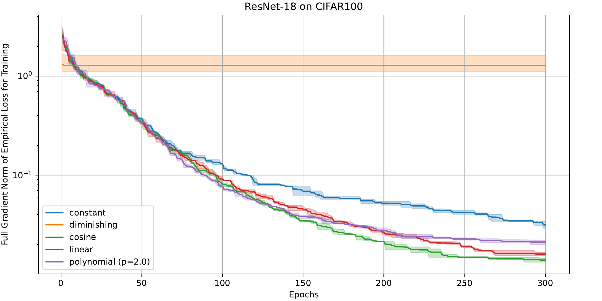 
            (b) Full gradient norm ||∇f(θ_e)|| versus epochs
        </td>
    </tr>
    <tr>
        <td align="center">
            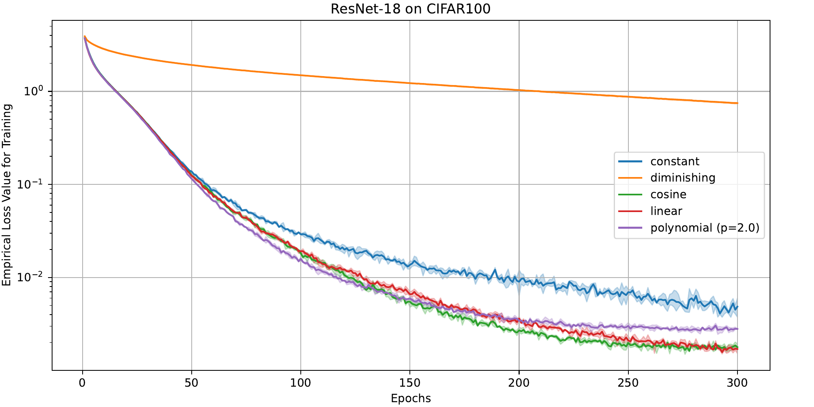 
            (c) Empirical loss f(θ_e) versus epochs
        </td>
        <td align="center">
            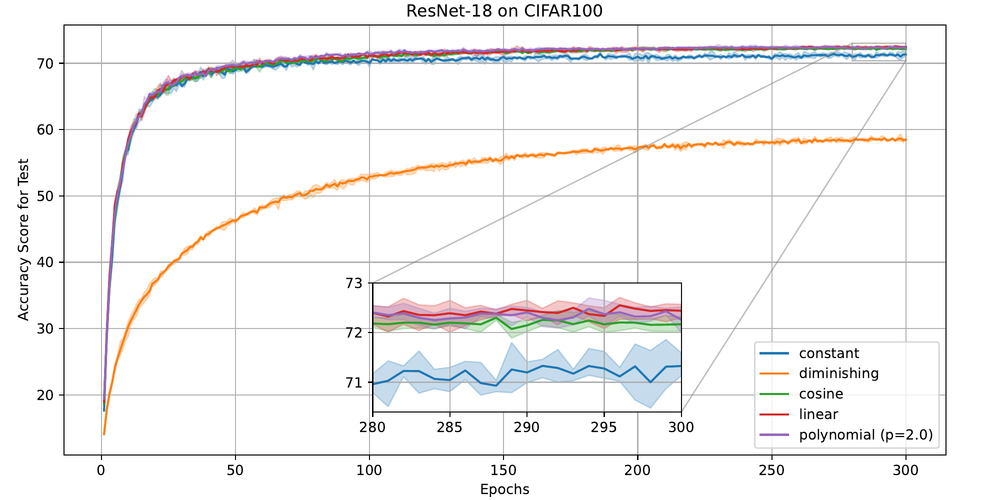 
            (d) Test accuracy score versus epochs
        </td>
    </tr>
</table>

**Figure 1:** (a) Decaying learning rates (constant, diminishing, cosine, linear, and polynomial) and constant batch size, (b) full gradient norm of empirical loss, (c) empirical loss value, and (d) accuracy score in testing for SGD to train ResNet-18 on CIFAR100 dataset.

---

<table align="center">
    <tr>
        <td align="center">
            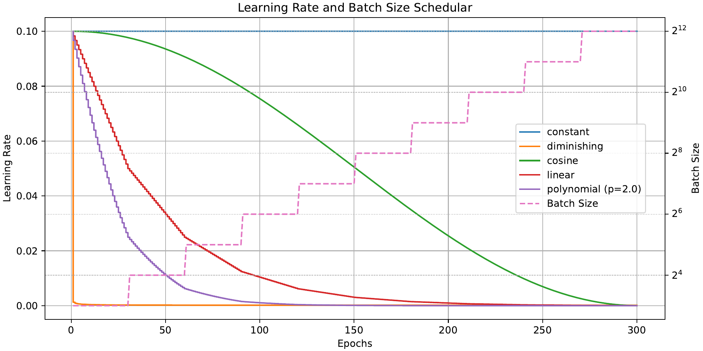 
            (a) Learning rate η_t and batch size b versus epochs
        </td>
        <td align="center">
            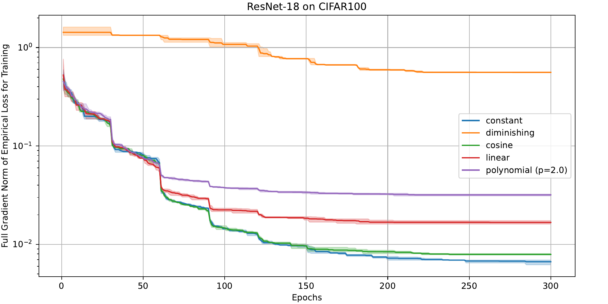 
            (b) Full gradient norm ||∇f(θ_e)|| versus epochs
        </td>
    </tr>
    <tr>
        <td align="center">
            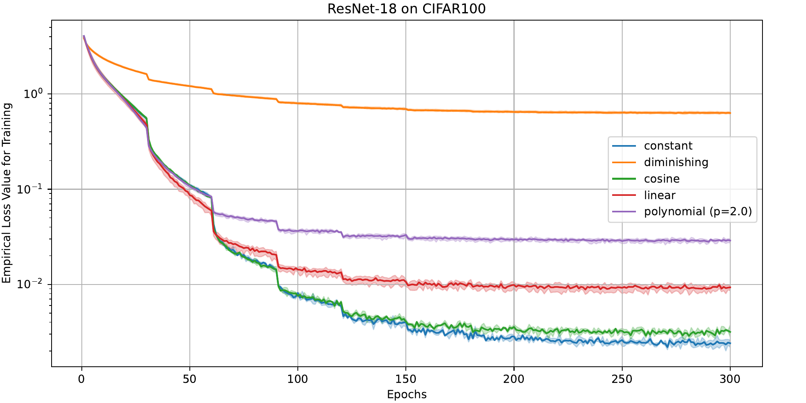 
            (c) Empirical loss f(θ_e) versus epochs
        </td>
        <td align="center">
            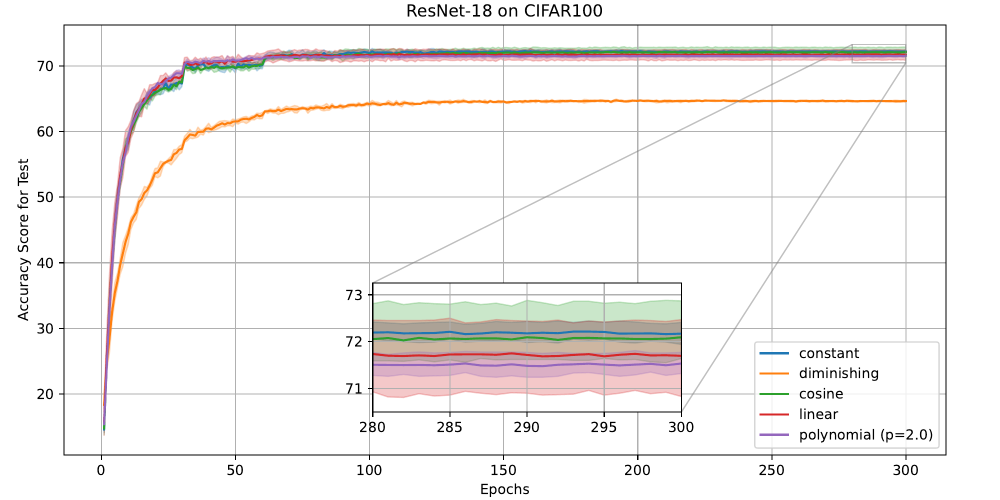 
            (d) Test accuracy score versus epochs
        </td>
    </tr>
</table>

**Figure 2:** (a) Decaying learning rates and doubly increasing batch size every 30 epochs, (b) full gradient norm of empirical loss, (c) empirical loss value, and (d) accuracy score in testing for SGD to train ResNet-18 on CIFAR100 dataset.

---

<table align="center">
    <tr>
        <td align="center">
            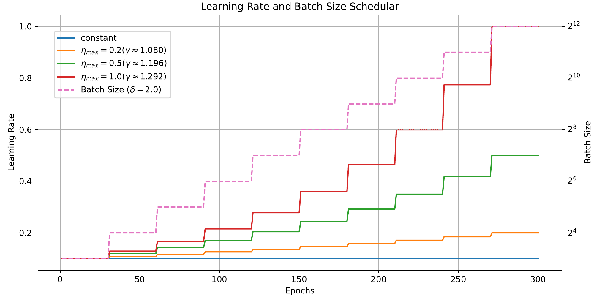 
            (a) Learning rate η_t and batch size b versus epochs
        </td>
        <td align="center">
            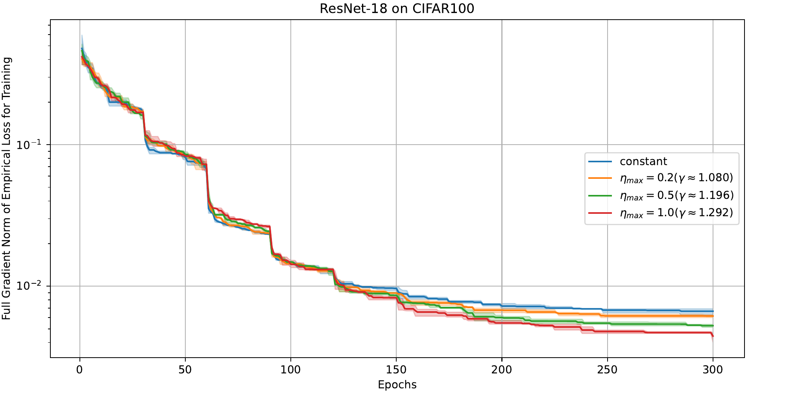 
            (b) Full gradient norm ||∇f(θ_e)|| versus epochs
        </td>
    </tr>
    <tr>
        <td align="center">
            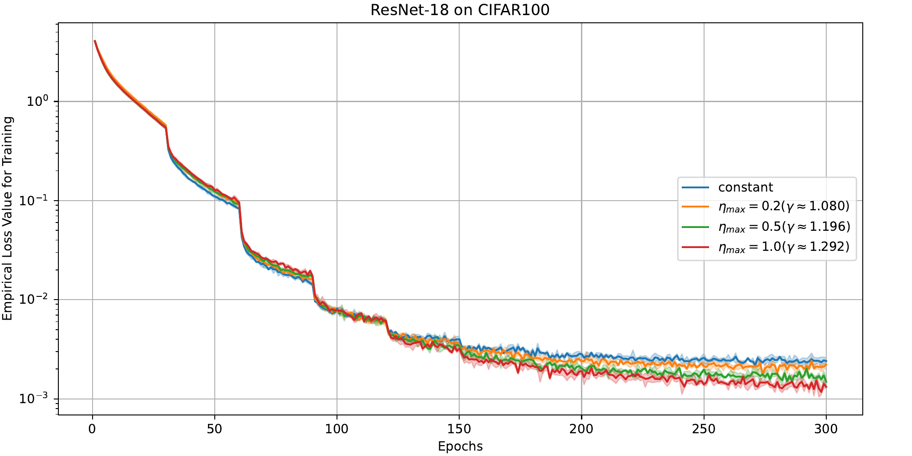 
            (c) Empirical loss f(θ_e) versus epochs
        </td>
        <td align="center">
            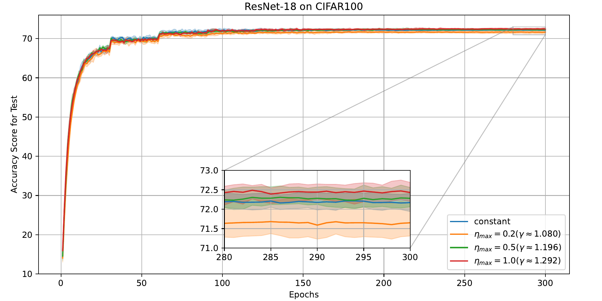 
            (d) Test accuracy score versus epochs
        </td>
    </tr>
</table>

**Figure 3:** (a) Increasing learning rates ($η_{max}$ = 0.2, 0.5, 1.0) and doubly increasing batch size every 30 epochs, (b) full gradient norm of empirical loss, (c) empirical loss value, and (d) accuracy score in testing for SGD to train ResNet-18 on CIFAR100 dataset.

---

<table align="center">
    <tr>
        <td align="center">
            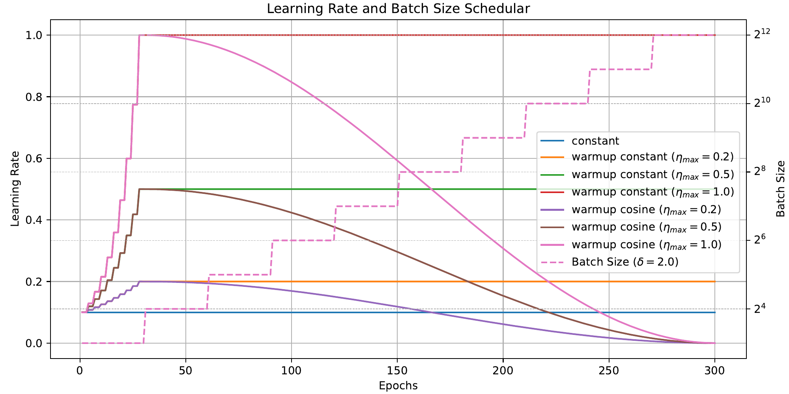 
            (a) Learning rate η_t and batch size b versus epochs
        </td>
        <td align="center">
            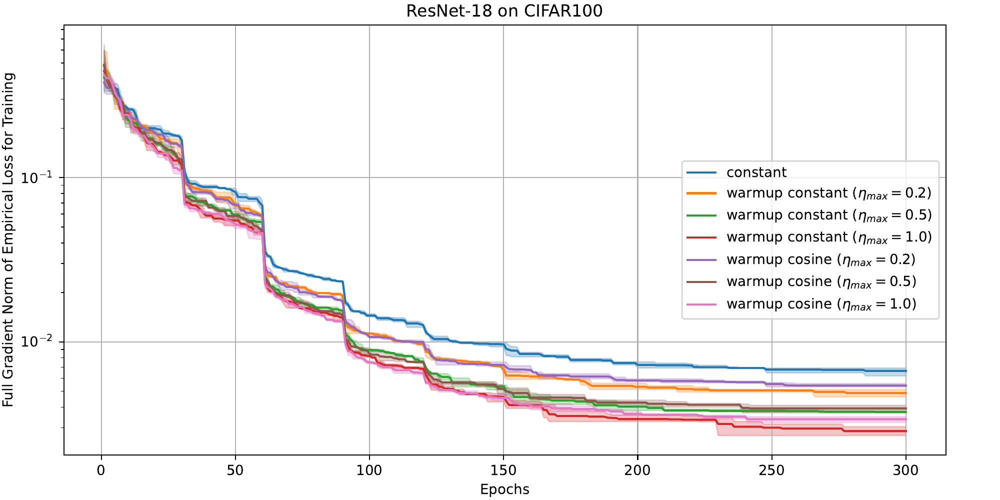 
            (b) Full gradient norm ||∇f(θ_e)|| versus epochs
        </td>
    </tr>
    <tr>
        <td align="center">
            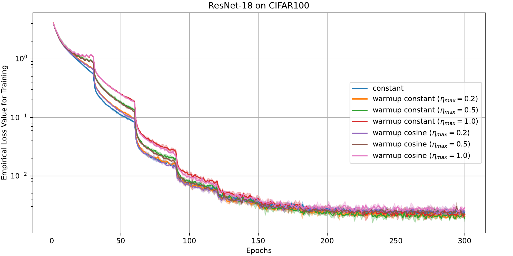 
            (c) Empirical loss f(θ_e) versus epochs
        </td>
        <td align="center">
            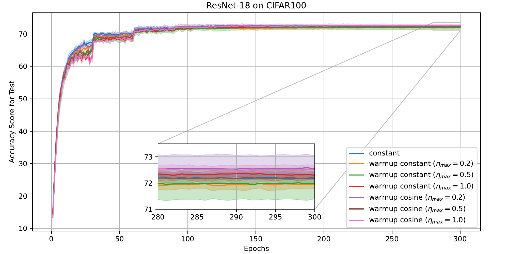 
            (d) Test accuracy score versus epochs
        </td>
    </tr>
</table>

**Figure 4:** (a) Warm-up learning rates and doubly increasing batch size every 30 epochs, (b) full gradient norm of empirical loss, (c) empirical loss value, and (d) accuracy score in testing for SGD to train ResNet-18 on CIFAR100 dataset.

---

<table align="center">
    <tr>
        <td align="center">
            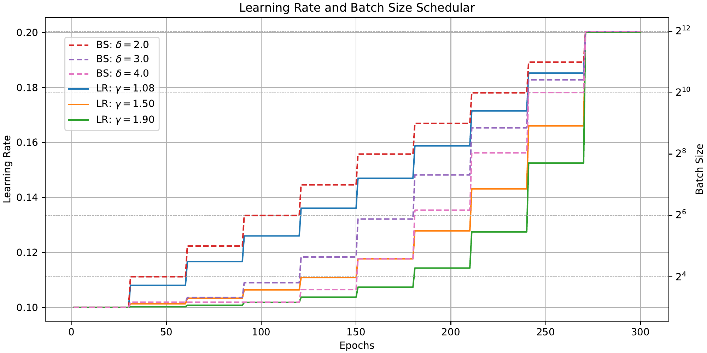 
            (a) Learning rate η_t and batch size b versus epochs
        </td>
        <td align="center">
            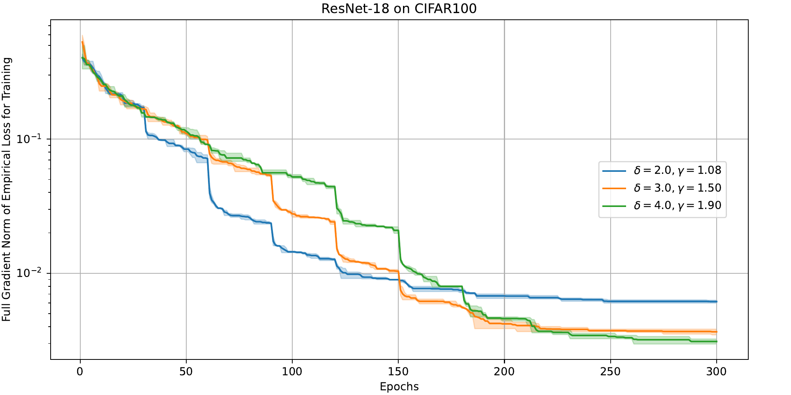 
            (b) Full gradient norm ||∇f(θ_e)|| versus epochs
        </td>
    </tr>
    <tr>
        <td align="center">
            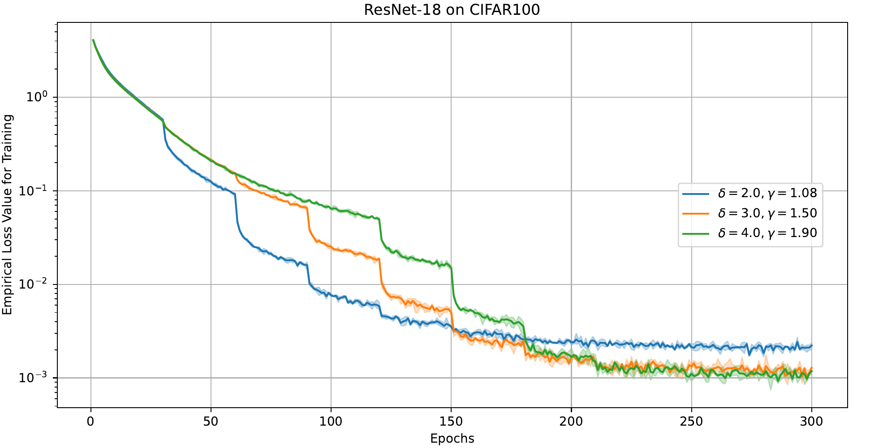 
            (c) Empirical loss f(θ_e) versus epochs
        </td>
        <td align="center">
            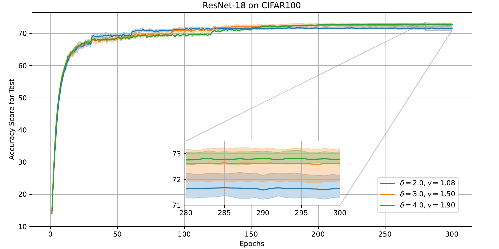 
            (d) Test accuracy score versus epochs
        </td>
    </tr>
</table>

**Figure 5:** (a) Increasing learning rates and increasing batch sizes based on $\delta$ = 2, 3, 4, (b) full gradient norm of empirical loss, (c) empirical loss value, and (d) accuracy score in testing for SGD to train ResNet-18 on CIFAR100 dataset.

---

## COMPARISONS OF CASE (II) WITH CASES (III) AND (IV) FOR TRAINING RESNET-18 ON CIFAR100 USING INCREASING BATCH SIZE BASED ON δ = 3

<table align="center">
    <tr>
        <td align="center">
            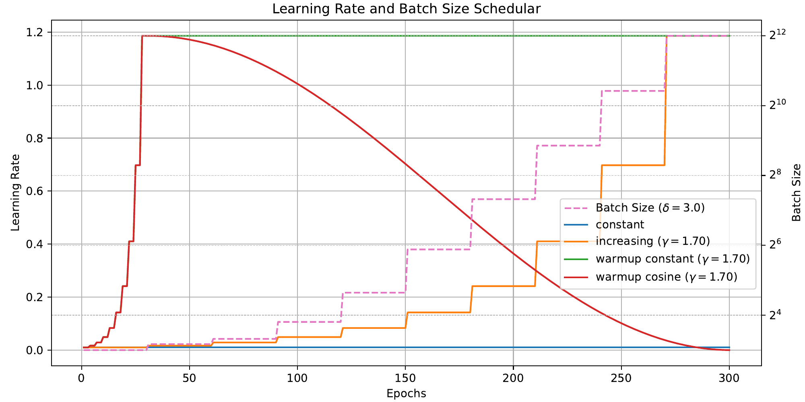 
            (a) Learning rate η_t and batch size b versus epochs
        </td>
        <td align="center">
            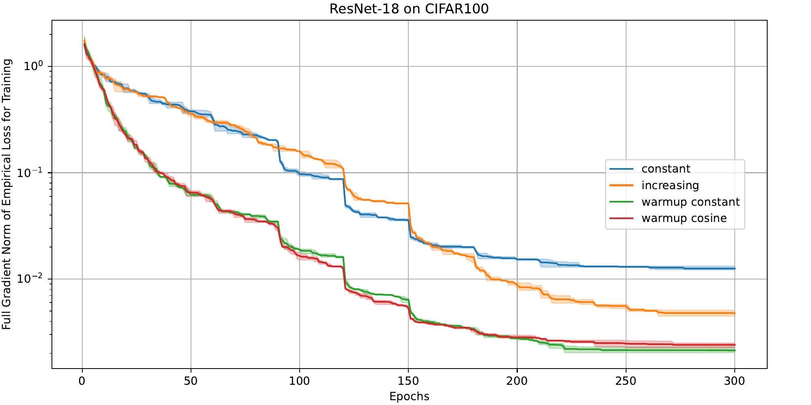 
            (b) Full gradient norm ||∇f(θ_e)|| versus epochs
        </td>
    </tr>
    <tr>
        <td align="center">
            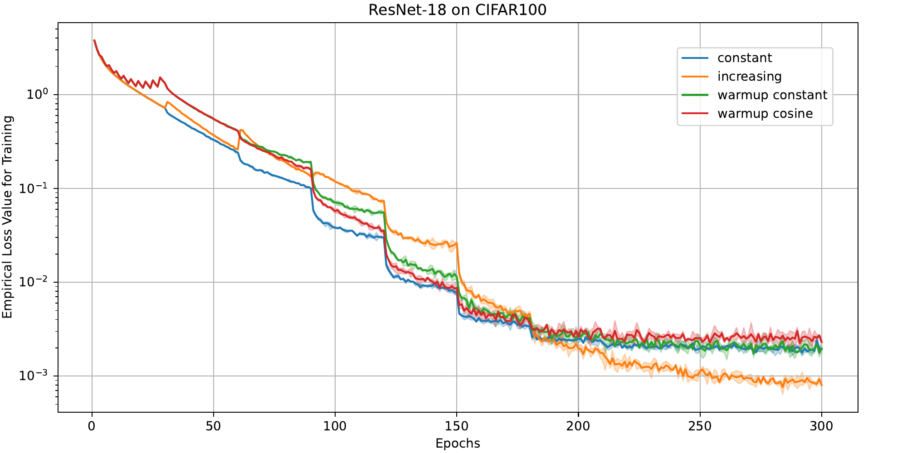 
            (c) Empirical loss f(θ_e) versus epochs
        </td>
        <td align="center">
            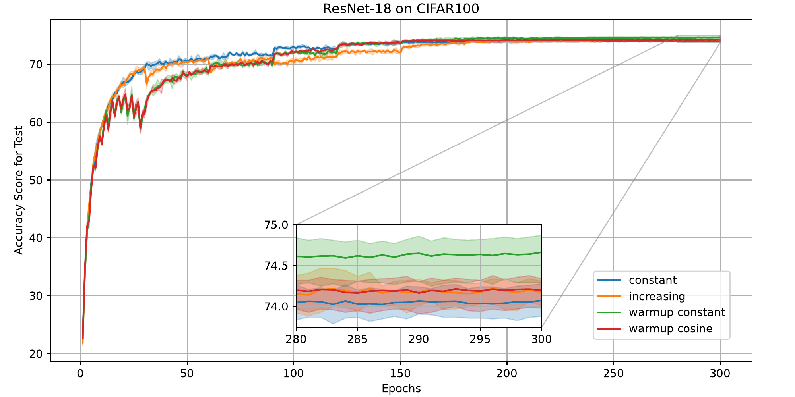 
            (d) Test accuracy score versus epochs
        </td>
    </tr>
</table>

**Figure 6:** (a) Increasing learning rates ($\eta_{min}$ = 0.01) and increasing batch sizes based on δ = 3, (b) full gradient norm of empirical loss, (c) empirical loss value, and (d) accuracy score in testing for SGD to train ResNet-18 on CIFAR100 dataset.

---

## ResNet-18 on CIFAR10 and CIFAR100 using DOUBLING, TRIPLING, and QUADRUPLING BATCH SIZES

<table align="center">
    <tr>
        <td align="center">
             
            (a) Learning rate η_t and batch size b versus epochs
        </td>
        <td align="center">
            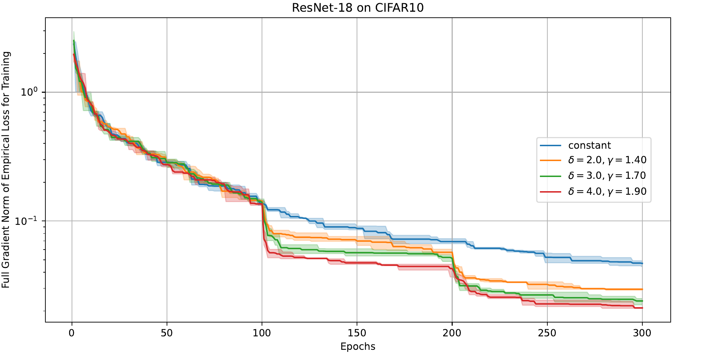 
            (b) Full gradient norm ||∇f(θ_e)|| versus epochs
        </td>
    </tr>
    <tr>
        <td align="center">
            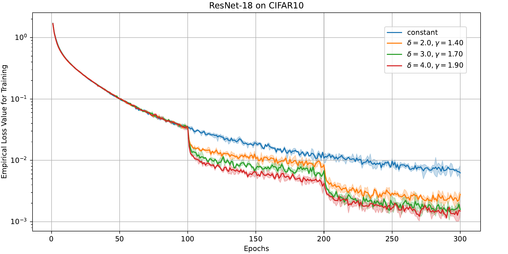 
            (c) Empirical loss f(θ_e) versus epochs
        </td>
        <td align="center">
            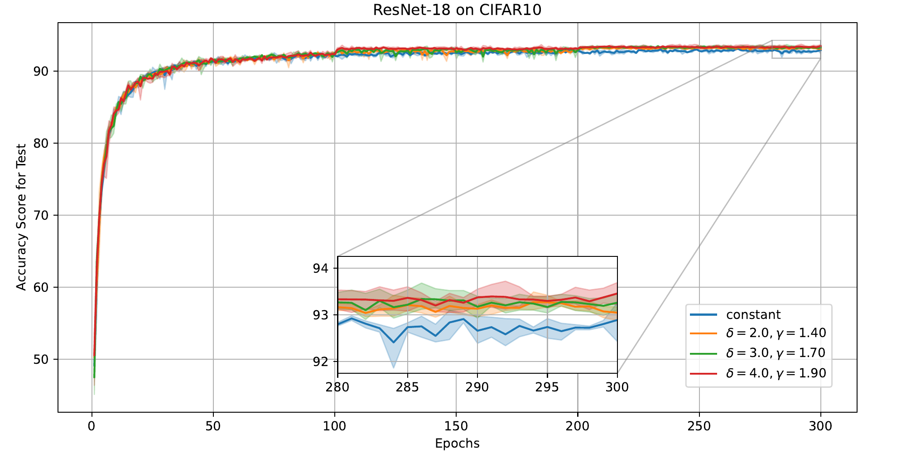 
            (d) Test accuracy score versus epochs
        </td>
    </tr>
</table>

**Figure 7:** (a) Increasing learning rates and doubling, tripling, and quadrupling batch sizes ((δ, γ) = (2, 1.4), (3, 1.7), (4, 1.9) satisfying $\sqrt{\delta}$ > γ) every 100 epochs, (b) full gradient norm of empirical loss, (c) empirical loss value, and (d) accuracy score in testing for SGD to train ResNet-18 on CIFAR10 dataset.

---

<table align="center">
    <tr>
        <td align="center">
            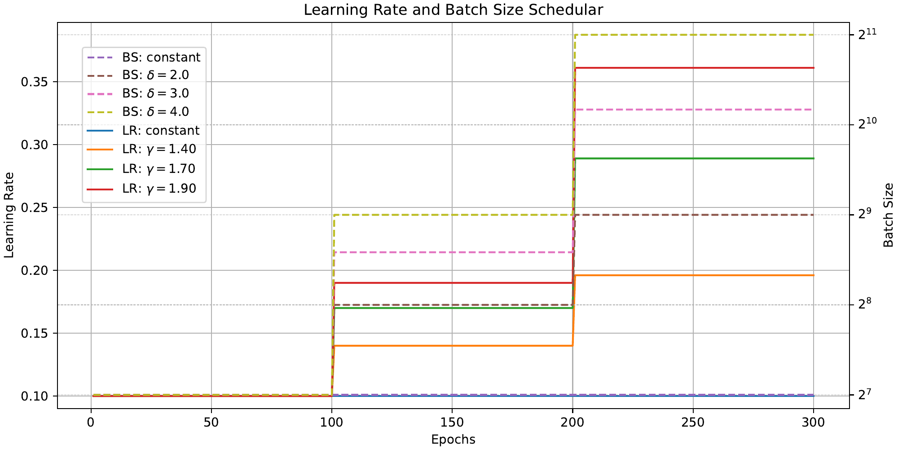 
            (a) Learning rate η_t and batch size b versus epochs
        </td>
        <td align="center">
            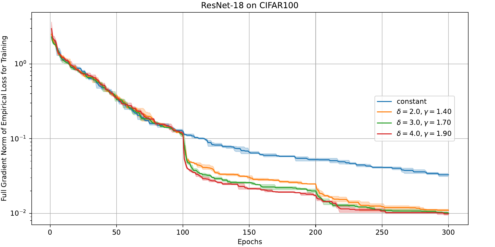 
            (b) Full gradient norm ||∇f(θ_e)|| versus epochs
        </td>
    </tr>
    <tr>
        <td align="center">
            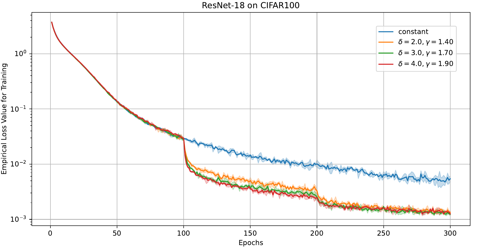 
            (c) Empirical loss f(θ_e) versus epochs
        </td>
        <td align="center">
            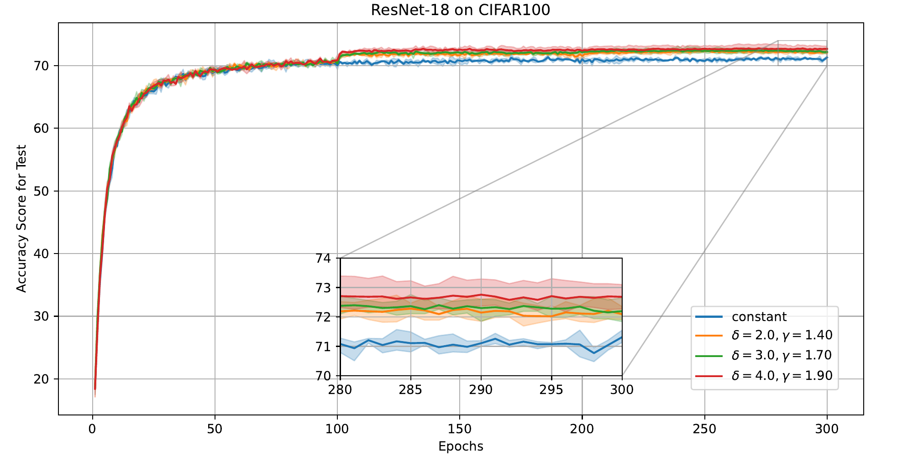 
            (d) Test accuracy score versus epochs
        </td>
    </tr>
</table>

**Figure 8:** (a) Increasing learning rates and doubling, tripling, and quadrupling batch sizes ((δ, γ) = (2, 1.4), (3, 1.7), (4, 1.9) satisfying $\sqrt{\delta}$ > γ) every 100 epochs, (b) full gradient norm of empirical loss, (c) empirical loss value, and (d) accuracy score in testing for SGD to train ResNet-18 on CIFAR100 dataset.

---

## Wide-ResNet-28-10 on CIFAR100

<table align="center">
    <tr>
        <td align="center">
            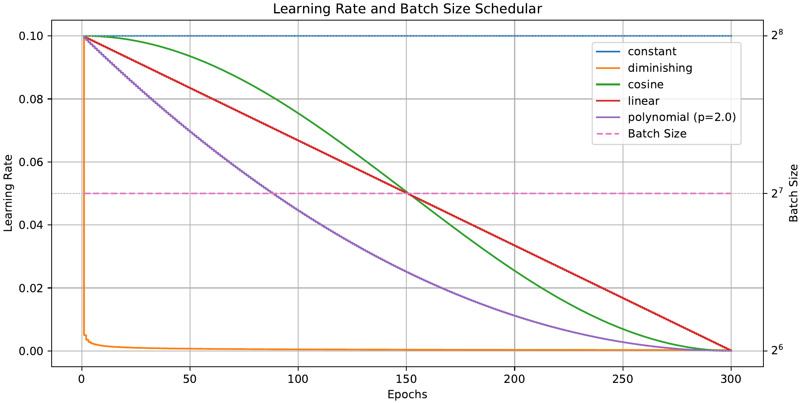 
            (a) Learning rate η_t and batch size b versus epochs
        </td>
        <td align="center">
            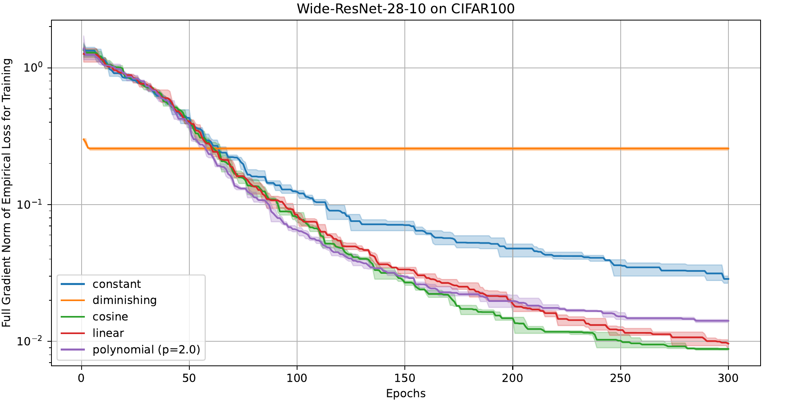 
            (b) Full gradient norm ||∇f(θ_e)|| versus epochs
        </td>
    </tr>
    <tr>
        <td align="center">
            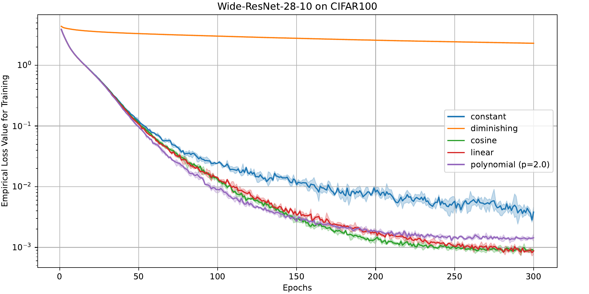 
            (c) Empirical loss f(θ_e) versus epochs
        </td>
        <td align="center">
            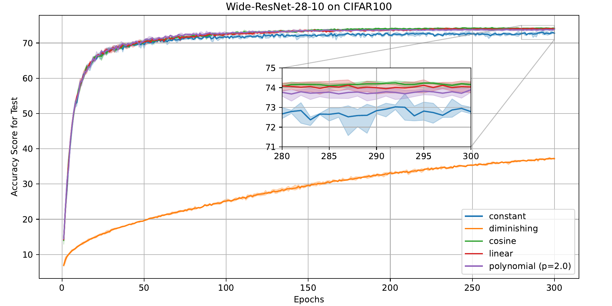 
            (d) Test accuracy score versus epochs
        </td>
    </tr>
</table>

**Figure 9:** (a) Decaying learning rates (constant, diminishing, cosine, linear, and polynomial) and constant batch size, (b) full gradient norm of empirical loss, (c) empirical loss value, and (d) accuracy score in testing for SGD to train Wide-ResNet-28-10 on CIFAR100 dataset.

---

<table align="center">
    <tr>
        <td align="center">
             
            (a) Learning rate η_t and batch size b versus epochs
        </td>
        <td align="center">
            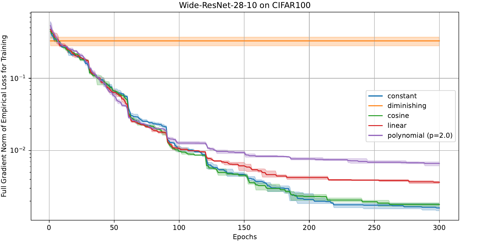 
            (b) Full gradient norm ||∇f(θ_e)|| versus epochs
        </td>
    </tr>
    <tr>
        <td align="center">
            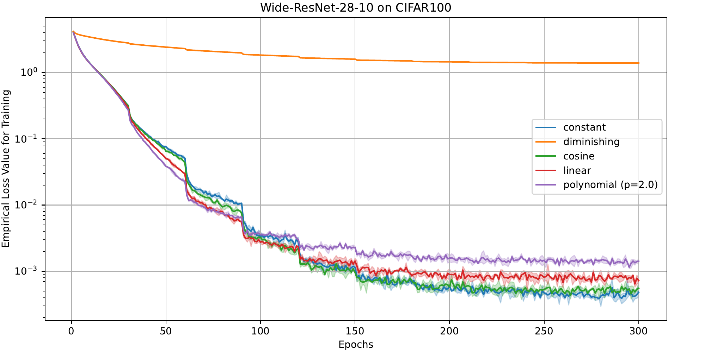 
            (c) Empirical loss f(θ_e) versus epochs
        </td>
        <td align="center">
            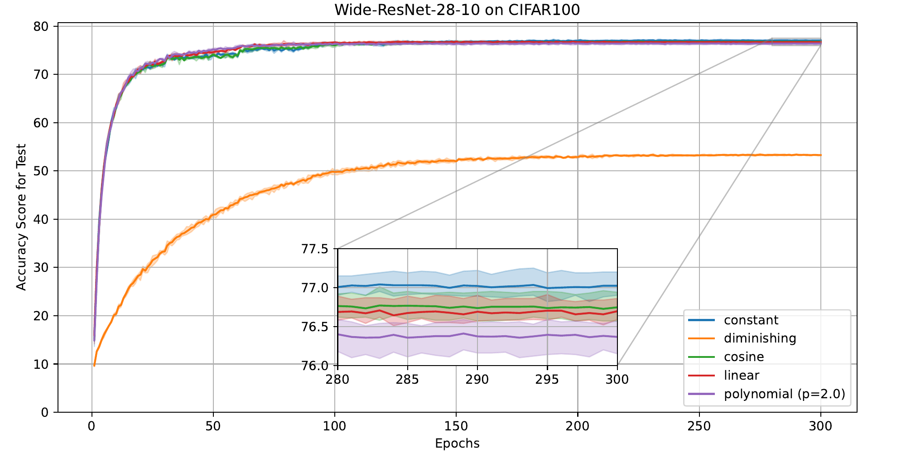 
            (d) Test accuracy score versus epochs
        </td>
    </tr>
</table>

**Figure 10:** (a) Decaying learning rates and increasing batch size every 30 epochs, (b) full gradient norm of empirical loss, (c) empirical loss value, and (d) accuracy score in testing for SGD to train Wide-ResNet-28-10 on CIFAR100 dataset.

---

<table align="center">
    <tr>
        <td align="center">
             
            (a) Learning rate η_t and batch size b versus epochs
        </td>
        <td align="center">
            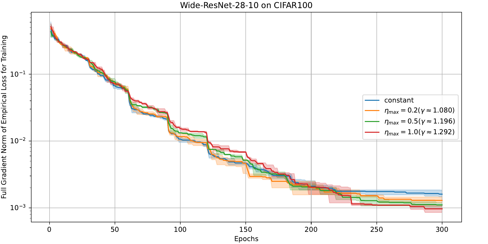 
            (b) Full gradient norm ||∇f(θ_e)|| versus epochs
        </td>
    </tr>
    <tr>
        <td align="center">
            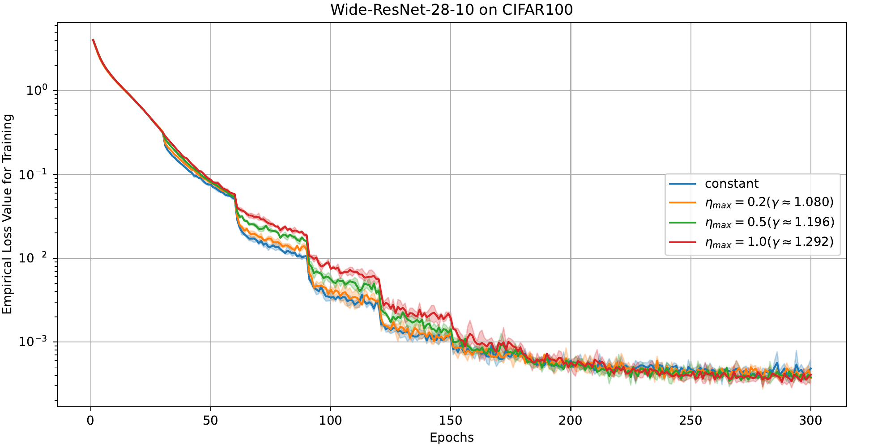 
            (c) Empirical loss f(θ_e) versus epochs
        </td>
        <td align="center">
            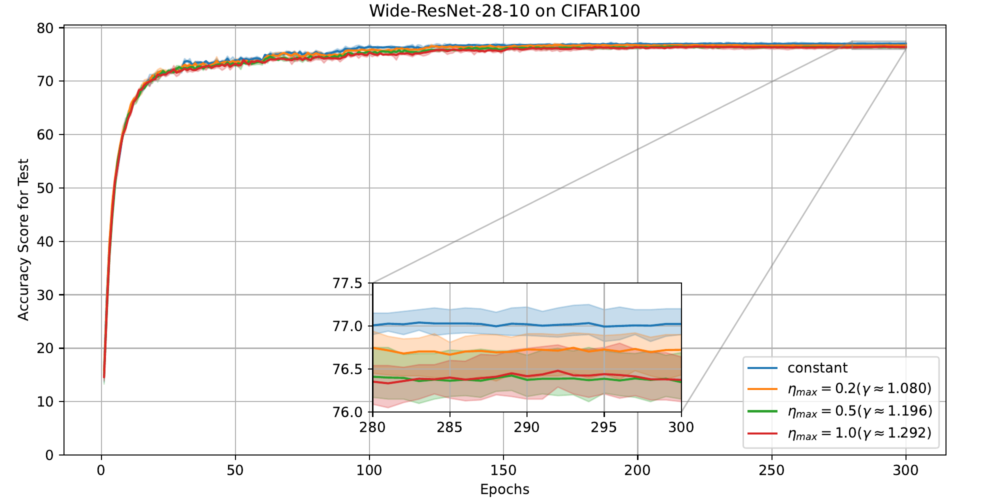 
            (d) Test accuracy score versus epochs
        </td>
    </tr>
</table>

**Figure 11:** (a) Increasing learning rates ($\eta_{max}$ = 0.2, 0.5, 1.0) and increasing batch size every 30 epochs, (b) full gradient norm of empirical loss, (c) empirical loss value, and (d) accuracy score in testing for SGD to train Wide-ResNet-28-10 on CIFAR100 dataset.

---

<table align="center">
    <tr>
        <td align="center">
            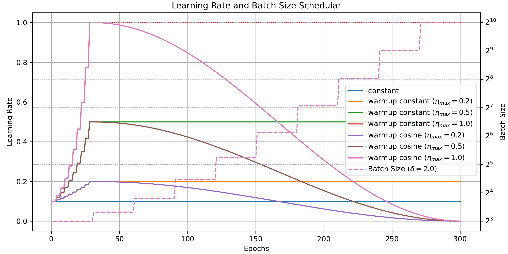 
            (a) Learning rate η_t and batch size b versus epochs
        </td>
        <td align="center">
            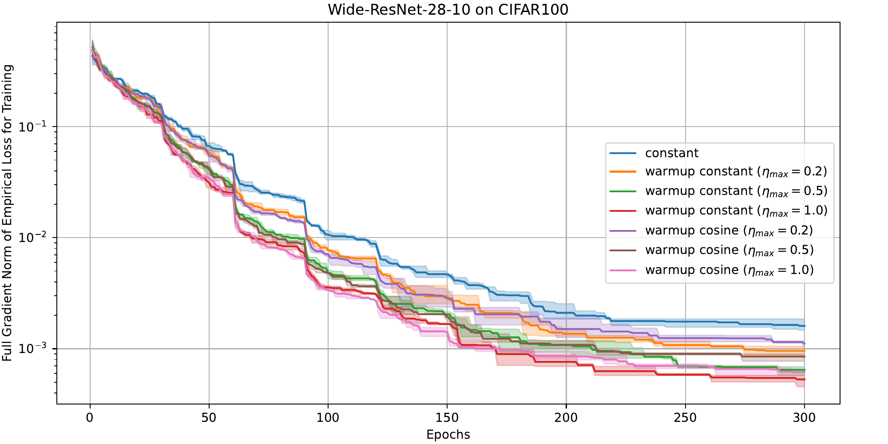 
            (b) Full gradient norm ||∇f(θ_e)|| versus epochs
        </td>
    </tr>
    <tr>
        <td align="center">
            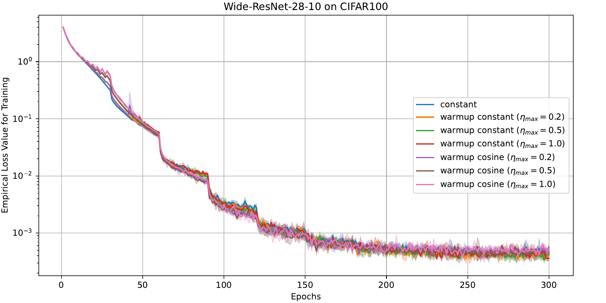 
            (c) Empirical loss f(θ_e) versus epochs
        </td>
        <td align="center">
            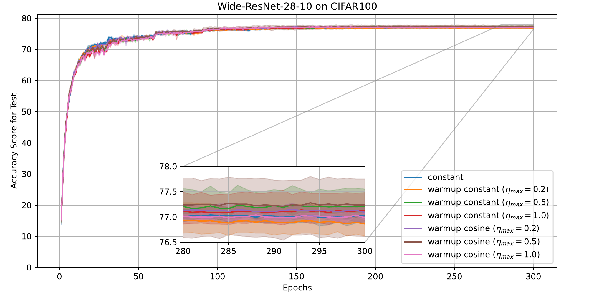 
            (d) Test accuracy score versus epochs
        </td>
    </tr>
</table>

**Figure 12:** (a) Warm-up learning rates and increasing batch size every 30 epochs, (b) full gradient norm of empirical loss, (c) empirical loss value, and (d) accuracy score in testing for SGD to train Wide-ResNet-28-10 on CIFAR100 dataset.

---

<table align="center">
    <tr>
        <td align="center">
            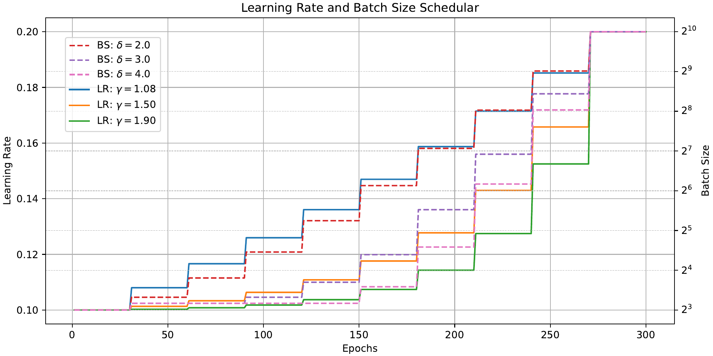 
            (a) Learning rate η_t and batch size b versus epochs
        </td>
        <td align="center">
            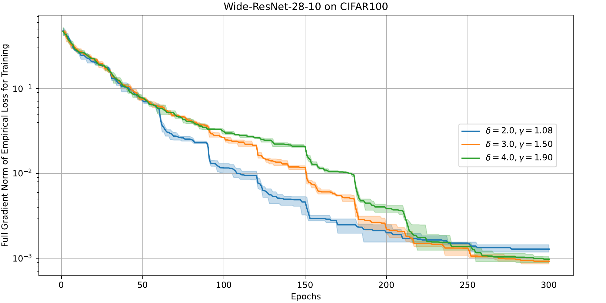 
            (b) Full gradient norm ||∇f(θ_e)|| versus epochs
        </td>
    </tr>
    <tr>
        <td align="center">
            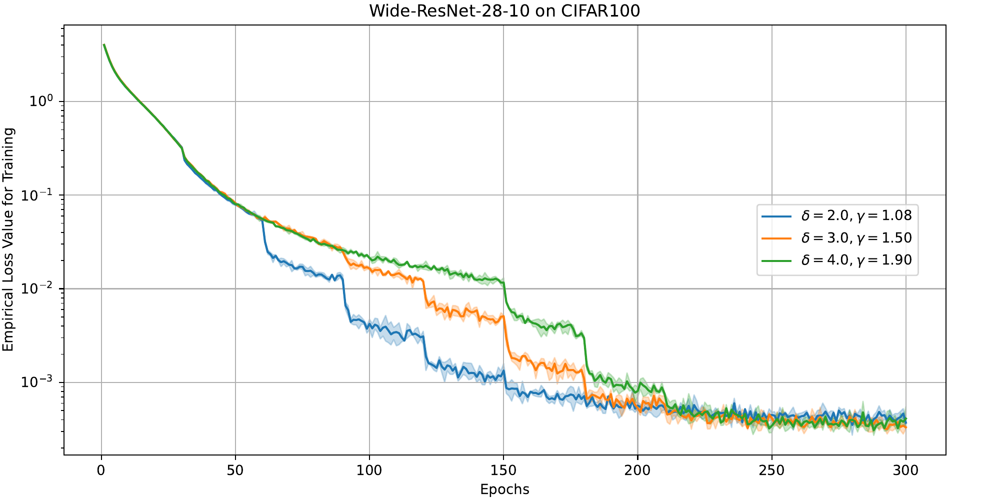 
            (c) Empirical loss f(θ_e) versus epochs
        </td>
        <td align="center">
             
            (d) Test accuracy score versus epochs
        </td>
    </tr>
</table>

**Figure 13:** (a) Increasing learning rates and increasing batch sizes based on $\delta$ = 2, 3, 4, (b) full gradient norm of empirical loss, (c) empirical loss value, and (d) accuracy score in testing for SGD to train Wide-ResNet-28-10 on CIFAR100 dataset.

---

## ResNet-18 on Tiny ImageNet

<table align="center">
    <tr>
        <td align="center">
             
            (a) Learning rate η_t and batch size b versus epochs
        </td>
        <td align="center">
            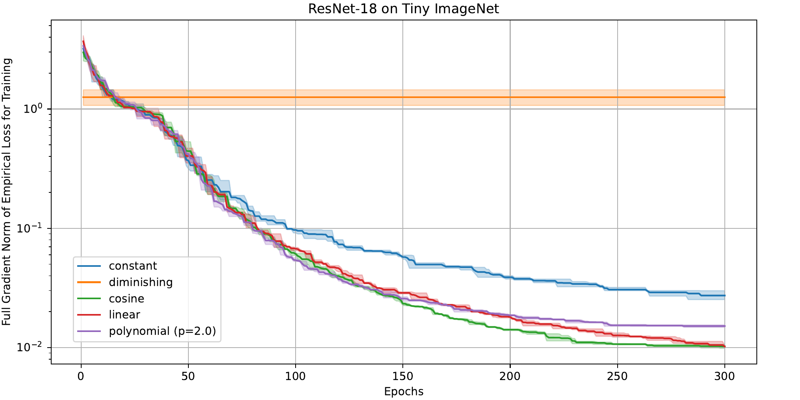 
            (b) Full gradient norm ||∇f(θ_e)|| versus epochs
        </td>
    </tr>
    <tr>
        <td align="center">
            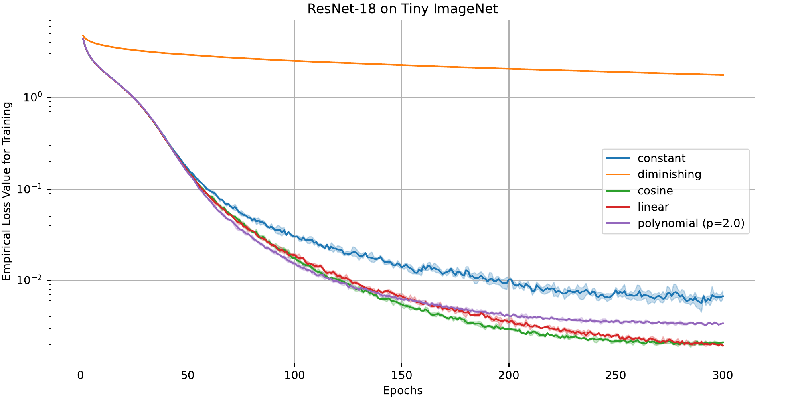 
            (c) Empirical loss f(θ_e) versus epochs
        </td>
        <td align="center">
            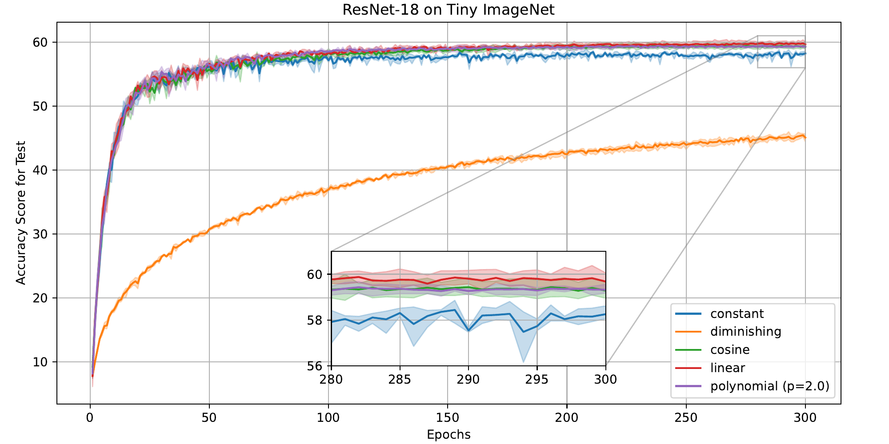 
            (d) Test accuracy score versus epochs
        </td>
    </tr>
</table>

**Figure 14:** (a) Decaying learning rates (constant, diminishing, cosine, linear, and polynomial) and constant batch size, (b) full gradient norm of empirical loss, (c) empirical loss value, and (d) accuracy score in testing for SGD to train ResNet-18 on Tiny ImageNet dataset.

---

<table align="center">
    <tr>
        <td align="center">
            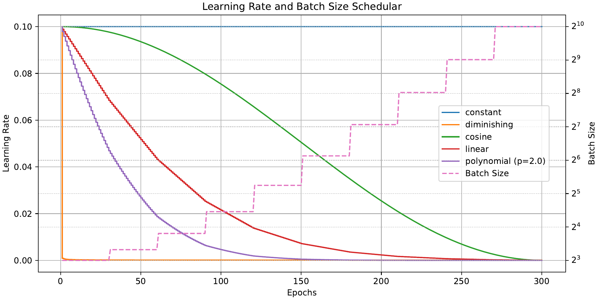 
            (a) Learning rate η_t and batch size b versus epochs
        </td>
        <td align="center">
            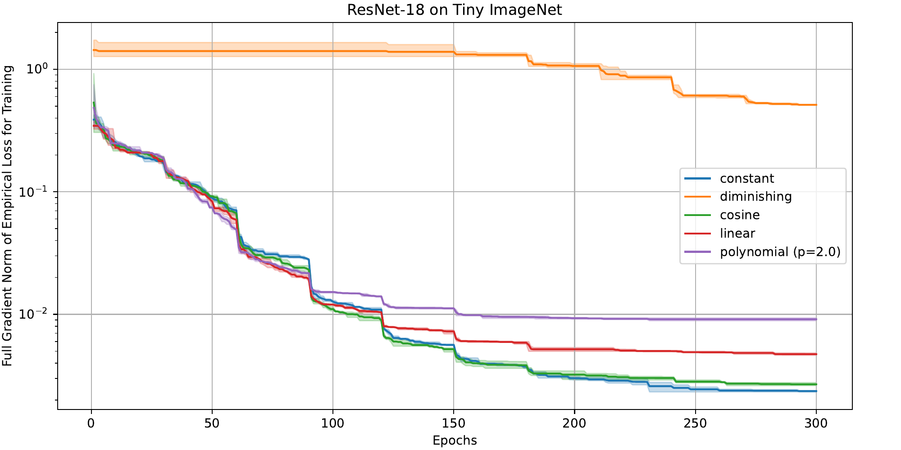 
            (b) Full gradient norm ||∇f(θ_e)|| versus epochs
        </td>
    </tr>
    <tr>
        <td align="center">
            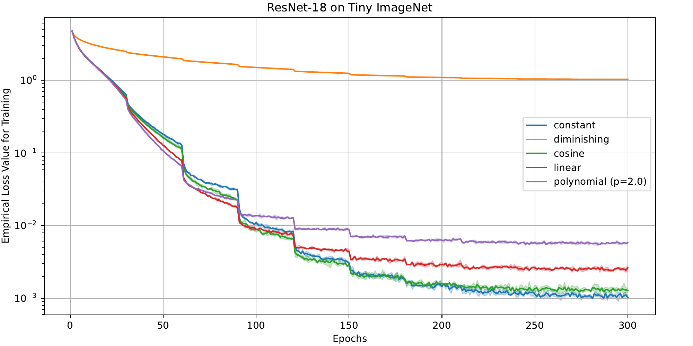 
            (c) Empirical loss f(θ_e) versus epochs
        </td>
        <td align="center">
            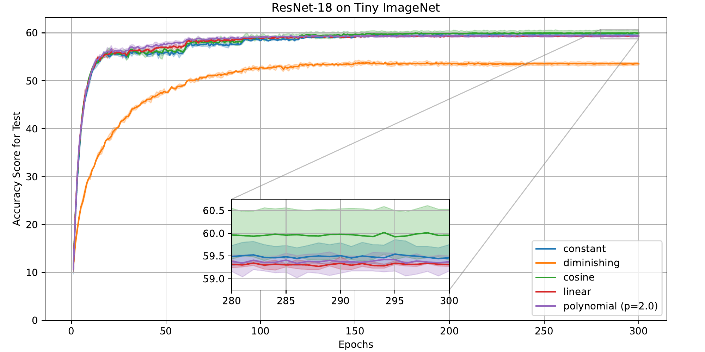 
            (d) Test accuracy score versus epochs
        </td>
    </tr>
</table>

**Figure 15:** (a) Decaying learning rates and increasing batch size every 30 epochs, (b) full gradient norm of empirical loss, (c) empirical loss value, and (d) accuracy score in testing for SGD to train ResNet-18 on Tiny ImageNet dataset.

---

<table align="center">
    <tr>
        <td align="center">
            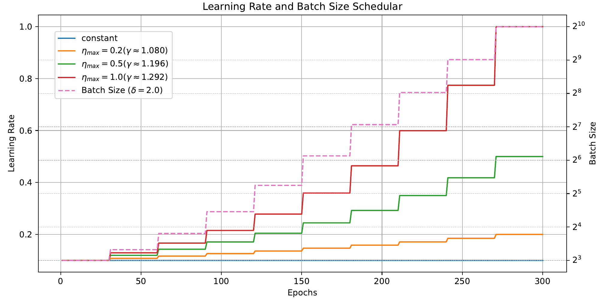 
            (a) Learning rate η_t and batch size b versus epochs
        </td>
        <td align="center">
            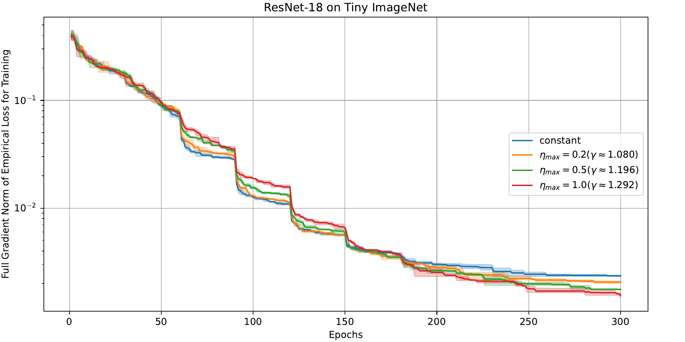 
            (b) Full gradient norm ||∇f(θ_e)|| versus epochs
        </td>
    </tr>
    <tr>
        <td align="center">
            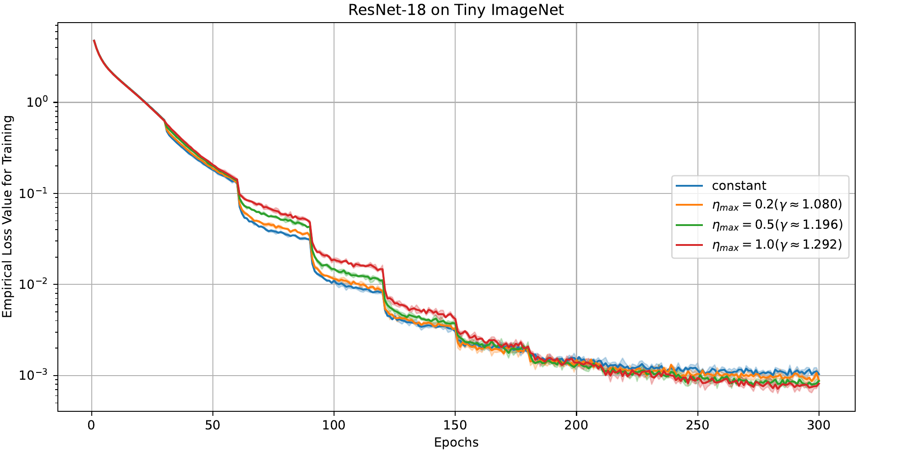 
            (c) Empirical loss f(θ_e) versus epochs
        </td>
        <td align="center">
            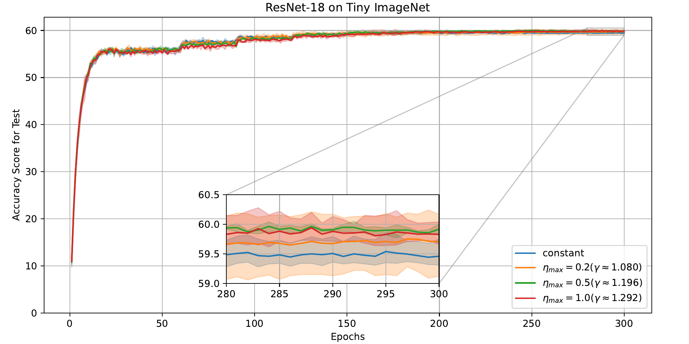 
            (d) Test accuracy score versus epochs
        </td>
    </tr>
</table>

**Figure 16:** (a) Increasing learning rates ($\eta_{max}$ = 0.2, 0.5, 1.0) and increasing batch size every 30 epochs, (b) full gradient norm of empirical loss, (c) empirical loss value, and (d) accuracy score in testing for SGD to train ResNet-18 on Tiny ImageNet dataset.

---

<table align="center">
    <tr>
        <td align="center">
             
            (a) Learning rate η_t and batch size b versus epochs
        </td>
        <td align="center">
            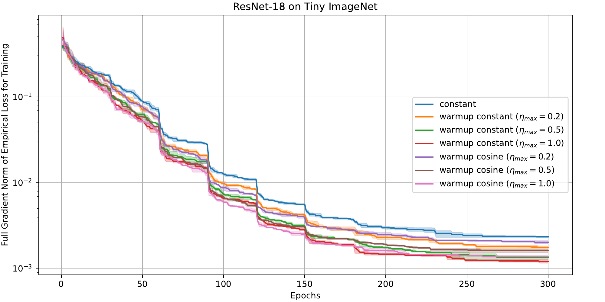 
            (b) Full gradient norm ||∇f(θ_e)|| versus epochs
        </td>
    </tr>
    <tr>
        <td align="center">
            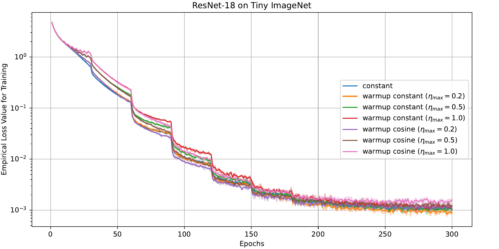 
            (c) Empirical loss f(θ_e) versus epochs
        </td>
        <td align="center">
            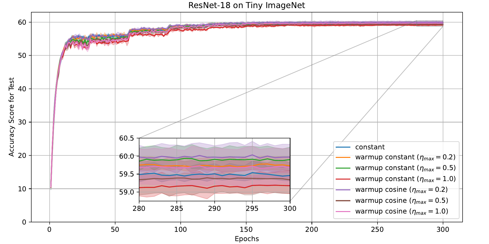 
            (d) Test accuracy score versus epochs
        </td>
    </tr>
</table>

**Figure 17:** (a) Warm-up learning rates and increasing batch size every 30 epochs, (b) full gradient norm of empirical loss, (c) empirical loss value, and (d) accuracy score in testing for SGD to train ResNet-18 on Tiny ImageNet dataset.

---

<table align="center">
    <tr>
        <td align="center">
             
            (a) Learning rate η_t and batch size b versus epochs
        </td>
        <td align="center">
            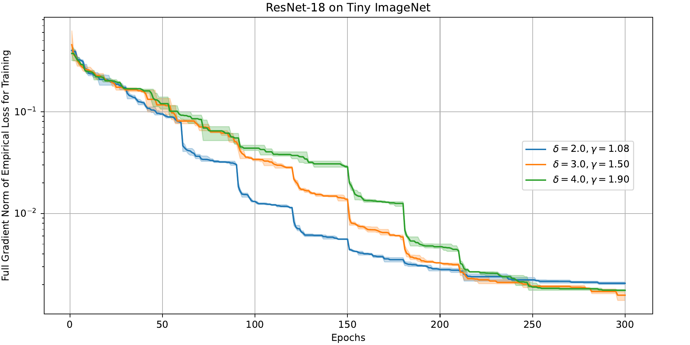 
            (b) Full gradient norm ||∇f(θ_e)|| versus epochs
        </td>
    </tr>
    <tr>
        <td align="center">
            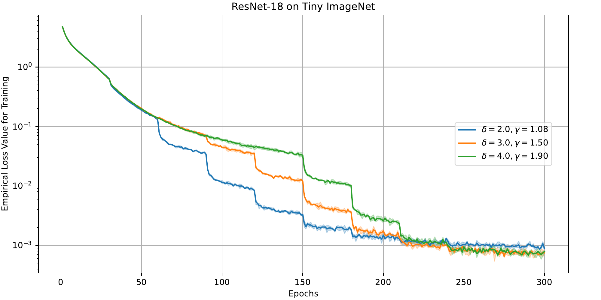 
            (c) Empirical loss f(θ_e) versus epochs
        </td>
        <td align="center">
            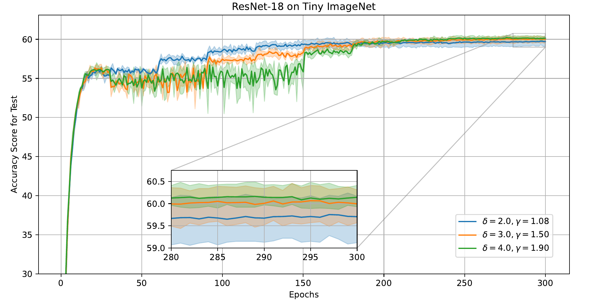 
            (d) Test accuracy score versus epochs
        </td>
    </tr>
</table>

**Figure 18:** (a) Increasing learning rates and increasing batch sizes based on $\delta$ = 2, 3, 4, (b) full gradient norm of empirical loss, (c) empirical loss value, and (d) accuracy score in testing for SGD to train ResNet-18 on Tiny ImageNet dataset.

---
